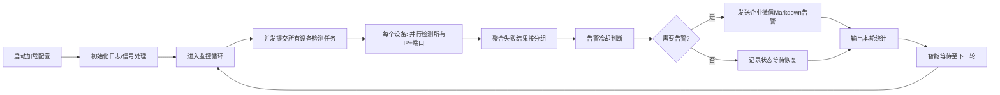

# 🚀 port-sentinel-rs v2.2.6

> **High Performance Async TCP Port Connectivity Monitoring System**  
> 高性能异步 TCP 端口连通性监控系统 | 企业微信告警 | 优雅停机 | 自动配置初始化

[](https://www.rust-lang.org)
[](LICENSE)
[](https://www.docker.com)

---

## 📋 目录

- [✨ 核心特性](#-核心特性)
- [🏗️ 系统架构](#️-系统架构)
- [📦 环境要求](#-环境要求)
- [⚡ 快速开始](#-快速开始)
- [⚙️ 配置详解](#️-配置详解)
- [🐳 Docker 部署](#-docker-部署)
- [🔔 企业微信告警配置](#-企业微信告警配置)
- [🔧 环境变量](#-环境变量)
- [📊 日志与监控](#-日志与监控)
- [🛠️ 开发指南](#️-开发指南)
- [❓ 故障排查](#-故障排查)
- [📜 版本历史](#-版本历史)
- [📄 许可证](#-许可证)

---

## ✨ 核心特性

| 特性                | 说明                                                          |
| ------------------- | ------------------------------------------------------------- |
| 🔥 **异步并发检测** | 基于 Tokio 异步运行时，支持数百并发连接，单节点可监控数千端口 |
| 📢 **企业微信告警** | 支持 Markdown 格式告警消息，含优先级标识、故障详情、恢复通知  |
| 🔄 **告警冷却机制** | 同一设备故障避免重复告警，支持故障恢复自动识别                |
| 🛡️ **权限保护**     | Unix 系统自动设置配置文件权限为 600，保护敏感信息             |
| 🌐 **环境变量注入** | 支持 `${WEBHOOK_URL}` 语法注入敏感配置，避免硬编码            |
| 🧩 **热配置重载**   | 修改 config.toml 后重启即可生效，无需重新编译                 |
| 🪟 **优雅停机**     | 支持 Ctrl+C 信号捕获，确保资源安全释放                        |
| 📦 **容器友好**     | 提供 Dockerfile 与 docker-compose.yml，一键容器化部署         |
| 📈 **统计输出**     | 每轮检测输出耗时统计，每 10 轮输出累计告警/恢复数据           |

---

## 🏗️ 系统架构

```
┌─────────────────────────────────────────┐
│           port-sentinel-rs              │
├─────────────────────────────────────────┤
│  ┌─────────────┐  ┌─────────────────┐   │
│  │ Config Loader│  │ Env Var Injector│   │
│  └──────┬──────┘  └────────┬────────┘   │
│         │                  │            │
│  ┌──────▼──────────────────▼──────┐    │
│  │     Monitoring Loop (Tokio)    │    │
│  │  ┌────────────────────────┐   │    │
│  │  │  Device Check Tasks    │   │    │
│  │  │  • Parallel IP Check   │   │    │
│  │  │  • Semaphore Rate Limit│   │    │
│  │  │  • Timeout Control     │   │    │
│  │  └────────┬───────────────┘   │    │
│  │           │                    │    │
│  │  ┌────────▼────────┐          │    │
│  │  │ Alert Manager   │          │    │
│  │  │ • Cooldown Check│          │    │
│  │  │ • Recovery Detect│         │    │
│  │  │ • WeCom Sender  │          │    │
│  │  └─────────────────┘          │    │
│  └───────────────────────────────┘    │
│         │                │            │
│  ┌──────▼────┐  ┌──────▼────┐         │
│  │ config.toml│  │  logs/    │         │
│  └───────────┘  └───────────┘         │
└────────────────────────────────────────┘
```

### 检测流程



---

## 📦 环境要求

### 编译环境

| 组件          | 最低版本 | 推荐版本       |
| ------------- | -------- | -------------- |
| Rust          | 1.70.0   | 1.75.0+        |
| Cargo         | 1.70.0   | 1.75.0+        |
| Debian/Ubuntu | 11+      | 12+ (Bookworm) |

### 运行环境

- **操作系统**: Linux (推荐 Debian 12/13), macOS, Windows (WSL2 推荐)
- **内存**: ≥ 256MB (监控 100 设备内)
- **CPU**: 单核即可，多核可提升并发检测效率
- **网络**: 需能访问目标设备端口 + 企业微信 API (`qyapi.weixin.qq.com`)

---

## ⚡ 快速开始

### 1️⃣ 克隆项目

```bash
git clone https://github.com/mtl-123/port-sentinel-rs.git
cd port-sentinel-rs
```

### 2️⃣ 编译发布版本

```bash
# 安装 Rust (如未安装)
curl --proto '=https' --tlsv1.2 -sSf https://sh.rustup.rs | sh

# 编译优化版本
cargo build --release

# 二进制文件位于:
# target/release/port-sentinel-rs
```

### 3️⃣ 首次运行（自动生成配置）

```bash
./target/release/port-sentinel-rs
```

首次运行会自动生成 `config.toml` 并提示编辑：

```
⚙️  Config file not found, creating default config: config.toml
🔐 Config file permission set to 600 (read/write only for owner)
✅ Default config generated: config.toml
📝 Please edit config file and restart program:
   1. Modify webhook to WeCom robot address
   2. Add devices to monitor
   3. Optional: Inject sensitive info via export WEBHOOK_URL=xxx
```

### 4️⃣ 编辑配置并启动

```bash
# 编辑配置文件
vim config.toml

# (可选) 通过环境变量注入 webhook
export WEBHOOK_URL="https://qyapi.weixin.qq.com/cgi-bin/webhook/send?key=xxx"

# 启动监控
./target/release/port-sentinel-rs
```

### 5️⃣ 验证运行

```
╔══════════════════════════════════════════════════════════╗
║     🚀 port-sentinel-rs v2.2.6 (High Performance)         ║
║        Keep Your Network Heartbeat Steady                ║
╚══════════════════════════════════════════════════════════╝

[2026-02-27T10:00:00+08:00] INFO: 📅 Startup time: 2026-02-27 10:00:00
[2026-02-27T10:00:00+08:00] INFO: ✓ Config loaded successfully
[2026-02-27T10:00:00+08:00] INFO:   ├─ Device count: 3
[2026-02-27T10:00:00+08:00] INFO:   ├─ Polling interval: 15s
[2026-02-27T10:00:00+08:00] INFO:   ├─ Connection timeout: 3s
[2026-02-27T10:00:00+08:00] INFO:   ├─ Alert cooldown: 300s
[2026-02-27T10:00:00+08:00] INFO:   └─ Concurrent limit: 100 connections

[2026-02-27T10:00:15+08:00] INFO: ✓ Round   1 | All devices normal | Elapsed: 2s
```

---

## ⚙️ 配置详解

配置文件 `config.toml` 采用 TOML 格式，支持扁平结构，添加设备只需复制 `[[device]]` 块。

### 🔹 全局设置 `[settings]`

| 参数                         | 类型   | 默认值   | 说明                                                            |
| ---------------------------- | ------ | -------- | --------------------------------------------------------------- |
| `interval`                   | u64    | `15`     | 检测轮询间隔（秒），**最小 5 秒**，推荐 15-60                   |
| `timeout`                    | u64    | `3`      | 单次 TCP 连接超时（秒），范围 1-30，内网推荐 3，公网推荐 10     |
| `alert_cooldown`             | u64    | `300`    | 同一设备告警冷却时间（秒），避免刷屏，推荐 300 (5 分钟)         |
| `webhook`                    | String | -        | 企业微信机器人 webhook 地址，支持 `${WEBHOOK_URL}` 环境变量替换 |
| `log_level`                  | String | `"info"` | 日志级别: `debug` \| `info` \| `warn` \| `error`                |
| `max_concurrent_connections` | usize  | `100`    | 最大并发连接数，建议 = CPU 核心数 × 10                          |

### 🔹 设备配置 `[[device]]`

| 字段       | 类型               | 必填 | 说明                                                      |
| ---------- | ------------------ | ---- | --------------------------------------------------------- |
| `id`       | String             | ✅   | 设备唯一标识，用于告警去重和状态跟踪                      |
| `name`     | String             | ✅   | 设备显示名称，告警消息中使用                              |
| `group`    | String             | ✅   | 设备分组，用于告警聚合（如: database, web, network）      |
| `priority` | String             | ✅   | 优先级: `critical`🔴 \| `high`🟠 \| `medium`🟡 \| `low`🔵 |
| `ips`      | Array\<String\>    | ✅   | 设备 IP 地址列表，支持多 IP 冗余检测                      |
| `os`       | String             | ✅   | 操作系统: `linux` \| `windows` \| `other`                 |
| `location` | String             | ✅   | 物理/逻辑位置描述，如"机房 A/机柜 03"                     |
| `checks`   | Array\<CheckItem\> | ✅   | 端口检测项列表                                            |

#### CheckItem 结构

| 字段   | 类型   | 必填 | 说明                                |
| ------ | ------ | ---- | ----------------------------------- |
| `port` | u16    | ✅   | 待检测的 TCP 端口号                 |
| `name` | String | ❌   | 端口服务名称，为空时显示 `port:XXX` |

### 🔹 配置示例

```toml
# ════════════════════════════════════════════════════════════
# Port-Sentinel-RS Config - Production Example (v2.2.6)
# ════════════════════════════════════════════════════════════

[settings]
interval = 30
timeout = 5
alert_cooldown = 600
webhook = "${WEBHOOK_URL}"
log_level = "info"
max_concurrent_connections = 200

# ── 核心数据库 ─────────────────────────────────────────────
[[device]]
id = "redis-cluster-01"
name = "Redis 集群主节点"
group = "database"
priority = "critical"
ips = ["192.168.1.133", "192.168.1.128", "192.168.1.134"]
os = "linux"
location = "核心机房/机柜 A03"
checks = [
    { port = 6379, name = "Redis 主端口" },
    { port = 16379, name = "Redis 集群总线" }
]

# ── Web 服务 ───────────────────────────────────────────────
[[device]]
id = "nginx-lb-01"
name = "Nginx 负载均衡器"
group = "web"
priority = "high"
ips = ["10.0.0.10", "10.0.0.11"]
os = "linux"
location = "云区域/深圳"
checks = [
    { port = 80, name = "HTTP" },
    { port = 443, name = "HTTPS" },
    { port = 8080, name = "Health Check" }
]

# ── 网络设备 ───────────────────────────────────────────────
[[device]]
id = "core-switch-01"
name = "核心交换机管理口"
group = "network"
priority = "critical"
ips = ["192.168.1.1"]
os = "other"
location = "核心机房/机柜 A01"
checks = [
    { port = 22, name = "SSH 管理" },
    { port = 443, name = "Web 管理" }
]
```

---

## 🐳 Docker 部署

### 方式一：Docker Compose（推荐）

```yaml
# docker-compose.yml
services:
  port-sentinel-rs:
    container_name: port-sentinel-rs
    build: .
    restart: unless-stopped
    volumes:
      - ./config.toml:/app/config.toml:ro
      - ./logs:/app/logs
    environment:
      - TZ=Asia/Shanghai
      - RUST_LOG=info
      - RUST_BACKTRACE=0
      # 🔹 推荐: 通过环境变量注入 webhook
      - WEBHOOK_URL=${WEBHOOK_URL}
    command: >
      sh -c "
        mkdir -p /app/logs &&
        chmod 777 /app/logs &&
        stdbuf -oL -eL ./port-sentinel-rs 2>&1 | tee -a /app/logs/port-sentinel.log
      "
    logging:
      driver: "json-file"
      options:
        max-size: "50m"
        max-file: "3"
```

#### 启动步骤

```bash
# 1. 准备配置文件
cp config.toml.example config.toml
vim config.toml  # 编辑 webhook 和设备列表

# 2. 设置环境变量（推荐）
export WEBHOOK_URL="https://qyapi.weixin.qq.com/cgi-bin/webhook/send?key=xxx"

# 3. 启动服务
docker compose up -d --build

# 4. 查看日志
docker compose logs -f port-sentinel-rs

# 5. 查看持久化日志
tail -f logs/port-sentinel.log
```

### 方式二：直接 Docker 运行

```bash
# 构建镜像
docker build -t port-sentinel-rs:2.2.6 .

# 运行容器
docker run -d \
  --name port-sentinel-rs \
  --restart unless-stopped \
  -v $(pwd)/config.toml:/app/config.toml:ro \
  -v $(pwd)/logs:/app/logs \
  -e TZ=Asia/Shanghai \
  -e WEBHOOK_URL="your_webhook_here" \
  -e RUST_LOG=info \
  port-sentinel-rs:2.2.6
```

### 🐳 Dockerfile 说明

```dockerfile
FROM debian:bookworm-slim

WORKDIR /app

# 复制预编译的二进制文件和配置文件
COPY target/release/port-sentinel-rs ./
COPY config.toml ./

# 默认启动命令（可通过 docker run 覆盖）
CMD ["./port-sentinel-rs"]
```

> 💡 **提示**: 建议先在本地 `cargo build --release` 编译好二进制文件，再构建 Docker 镜像，避免在容器内编译。

---

## 🔔 企业微信告警配置

### 1️⃣ 创建企业微信机器人

1. 进入企业微信管理后台 → 应用管理 → 自建 → 创建「群机器人」
2. 选择目标群聊 → 添加机器人 → 获取 **Webhook 地址**
3. 安全设置建议选择「IP 地址白名单」，填入服务器公网 IP

### 2️⃣ 告警消息格式示例

```markdown
🔴 **Redis 主节点** Failure Alert

> 📍 Location：核心机房/机柜 A03
> 💻 OS：linux | 🏷️ Group：database
> ⚠️ Priority：critical

**Failure Details**:
```

┌─ 🔴 Redis 主端口 (Port：6379)
│ ├─ ❌ 192.168.1.133
│ └─ ❌ 192.168.1.128
│
┌─ 🔴 Redis 集群总线 (Port：16379)
│ └─ ❌ 192.168.1.133
│
└─ 📊 Stats：2 checks failed | 3 IPs affected

```

---
<font color="warning">Recommendation：Check device power/network/service status</font>
```

### 3️⃣ 告警策略

| 场景       | 行为                                                                         |
| ---------- | ---------------------------------------------------------------------------- |
| 首次故障   | 立即发送告警                                                                 |
| 持续故障   | 等待 `alert_cooldown` 秒后再次告警                                           |
| 故障恢复   | 自动清除状态，**不发送恢复通知**（避免刷屏），日志记录 `✅ Device recovered` |
| 多 IP 冗余 | 任一 IP 端口通畅即视为设备正常                                               |

---

## 🔧 环境变量

| 变量名           | 说明                                                     | 示例                                |
| ---------------- | -------------------------------------------------------- | ----------------------------------- |
| `WEBHOOK_URL`    | 企业微信 webhook 地址，自动替换配置中的 `${WEBHOOK_URL}` | `https://qyapi.weixin.qq.com/...`   |
| `LOG_LEVEL`      | 覆盖配置文件的日志级别                                   | `debug` / `info` / `warn` / `error` |
| `TZ`             | 时区设置，影响日志时间戳                                 | `Asia/Shanghai`                     |
| `RUST_LOG`       | Rust 原生日志过滤器（调试用）                            | `port_sentinel_rs=debug`            |
| `RUST_BACKTRACE` | 是否启用错误堆栈跟踪                                     | `0` / `1`                           |

### 使用示例

```bash
# Bash
export WEBHOOK_URL="https://qyapi.weixin.qq.com/..."
export LOG_LEVEL="debug"
./target/release/port-sentinel-rs

# Docker Compose
environment:
  - WEBHOOK_URL=${WEBHOOK_URL}
  - LOG_LEVEL=info

# Systemd (可选)
# /etc/systemd/system/port-sentinel-rs.service
[Service]
Environment="WEBHOOK_URL=https://..."
Environment="LOG_LEVEL=info"
```

---

## 📊 日志与监控

### 日志输出格式

```
[2026-02-27T10:00:15+08:00] INFO: ✓ Round   1 | All devices normal | Elapsed: 2s
[2026-02-27T10:05:30+08:00] WARN: ⚠ Round  12 | 2 devices failed | 1 alerts sent | Elapsed: 5s
[2026-02-27T10:10:00+08:00] INFO: ✅ Device recovered: Redis 主节点 (redis-cluster-01)
```

### 日志文件管理

- **Docker 部署**: 日志自动输出到 `./logs/port-sentinel.log`，配合 `docker-compose.yml` 的 logging 配置实现轮转
- **本地部署**: 建议使用 `nohup` 或 `systemd` 管理，示例：

```bash
# 使用 nohup 后台运行
nohup ./target/release/port-sentinel-rs > logs/port-sentinel.log 2>&1 &

# 使用 systemd (创建 /etc/systemd/system/port-sentinel-rs.service)
[Unit]
Description=Port Sentinel Monitoring Service
After=network.target

[Service]
Type=simple
User=monitor
WorkingDirectory=/opt/port-sentinel-rs
ExecStart=/opt/port-sentinel-rs/port-sentinel-rs
Restart=on-failure
RestartSec=10s
Environment=WEBHOOK_URL=https://...
Environment=LOG_LEVEL=info

[Install]
WantedBy=multi-user.target
```

### 监控指标建议

可配合 Prometheus + Grafana 监控以下指标（需二次开发）：

- `sentinel_round_total`: 检测轮次计数
- `sentinel_device_status{device_id,group}`: 设备状态（0=正常，1=故障）
- `sentinel_alert_total{device_id,priority}`: 告警次数
- `sentinel_check_duration_seconds`: 单轮检测耗时

---

## 🛠️ 开发指南

### 项目结构

```
port-sentinel-rs/
├── Cargo.toml          # 依赖与元数据
├── Cargo.lock          # 依赖锁定
├── config.toml         # 默认配置模板
├── docker-compose.yml  # 容器编排
├── Dockerfile          # 容器构建
├── README.md           # 本文档
└── src/
    └── main.rs         # 核心逻辑（单文件架构，便于维护）
```

### 核心模块说明

| 模块             | 文件位置          | 职责                                 |
| ---------------- | ----------------- | ------------------------------------ |
| Config           | `main.rs:25-80`   | 配置结构定义、默认值、加载与验证     |
| AlertState       | `main.rs:83-130`  | 告警状态管理、冷却控制、恢复检测     |
| Port Checker     | `main.rs:133-210` | 异步端口检测、并发控制、结果聚合     |
| WeCom Sender     | `main.rs:213-280` | 企业微信 Markdown 告警发送、重试机制 |
| Config Generator | `main.rs:283-350` | 默认配置生成、权限保护、用户引导     |
| Main Loop        | `main.rs:390-520` | 监控主循环、任务调度、信号处理       |

### 编译与测试

```bash
# 开发模式编译
cargo build

# 发布模式编译（优化 + 移除调试符号）
cargo build --release

# 运行
cargo run --release

# 代码格式检查
cargo fmt --check

# 代码静态分析
cargo clippy -- -D warnings

# 运行测试（需补充单元测试）
cargo test
```

### 添加新检测逻辑

如需扩展检测类型（如 HTTP 状态码、SSL 证书过期等）：

1. 在 `CheckItem` 结构中添加新字段（如 `protocol: String`）
2. 在 `check_item_with_parallel_ip` 中根据 protocol 分支调用不同检测函数
3. 更新 `config.toml` 示例和配置验证逻辑

---

## ❓ 故障排查

### 🔴 启动失败：webhook URL 无效

```
✗ Config load failed: webhook URL is required and must start with http/https...
```

**解决方案**:

- 检查 `config.toml` 中 `webhook` 字段是否以 `https://` 开头
- 或使用环境变量注入：`export WEBHOOK_URL="https://..."`
- 注意去除 URL 末尾多余空格

### 🔴 端口检测全部超时

```
WARN: ⚠ Round   1 | 5 devices failed | 3 alerts sent | Elapsed: 30s
```

**排查步骤**:

1. 检查服务器到目标 IP 的网络连通性：`ping <ip>` / `telnet <ip> <port>`
2. 确认 `timeout` 设置是否过小（公网建议 ≥ 5s）
3. 检查防火墙/安全组是否放行出站连接
4. 查看日志级别设为 `debug` 获取详细连接信息

### 🔴 企业微信收不到告警

**排查清单**:

- [ ] Webhook 地址是否正确（含完整 key）
- [ ] 服务器是否能访问 `qyapi.weixin.qq.com:443`
- [ ] 企业微信机器人是否启用「IP 白名单」且包含服务器 IP
- [ ] 告警内容是否超过企业微信长度限制（Markdown ≤ 4096 字符）

### 🔴 配置文件权限问题（Unix）

```
warn: Failed to set file permissions for config.toml: Operation not permitted
```

**原因**: 容器内或非 owner 用户运行  
**解决**:

- 确保运行用户对 config.toml 有写权限
- 或忽略该警告（不影响功能，仅安全加固提示）

---

## 📜 版本历史

| 版本   | 日期    | 变更说明                                                                                                                      |
| ------ | ------- | ----------------------------------------------------------------------------------------------------------------------------- |
| v2.2.6 | 2026-02 | ✅ 修复告警状态判断核心逻辑<br>✅ 优化 WeCom 消息垂直排版<br>✅ 添加故障恢复自动识别<br>✅ 支持 `${WEBHOOK_URL}` 环境变量注入 |
| v2.2.0 | 2026-01 | 🔧 重构并发检测架构，使用 JoinSet + Semaphore<br>🔧 添加 graceful shutdown 支持<br>🔧 日志输出优化，支持 Chrono 时间格式      |
| v2.1.0 | 2025-12 | 🚀 初始开源版本<br>✨ 异步 TCP 检测 + 企业微信告警 + 配置热加载                                                               |

---

## 📄 许可证

本项目采用 [MIT License](LICENSE) 开源协议。

```
MIT License

Copyright (c) 2026 MTL

Permission is hereby granted, free of charge, to any person obtaining a copy
of this software and associated documentation files (the "Software"), to deal
in the Software without restriction, including without limitation the rights
to use, copy, modify, merge, publish, distribute, sublicense, and/or sell
copies of the Software, and to permit persons to whom the Software is
furnished to do so, subject to the following conditions:

The above copyright notice and this permission notice shall be included in all
copies or substantial portions of the Software.
```

---

## 🤝 贡献指南

欢迎提交 Issue 和 Pull Request！提交前请：

1. 使用 `cargo fmt` 格式化代码
2. 通过 `cargo clippy` 静态检查
3. 在 PR 描述中说明变更内容和测试情况

---

> **💡 温馨提示**  
> 本工具为运维辅助监控使用，**不建议替代专业监控系统**（如 Zabbix、Prometheus）。  
> 生产环境请结合日志聚合、告警升级、故障自愈等机制构建完整可观测性体系。

---

<div align="center">

**Keep Your Network Heartbeat Steady** ❤️

[🔗 GitHub 仓库](https://github.com/mtl-123/port-sentinel-rs) | [📦 Releases](https://github.com/mtl-123/port-sentinel-rs/releases)

</div>
